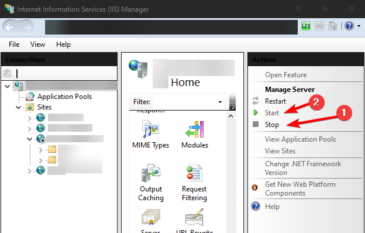

# SvelteKit Adapter IIS

[](https://sveltesociety.dev/packages?category=sveltekit-adapters)[](https://www.npmjs.com/package/sveltekit-adapter-iis)

This package contains an adapter for Sveltekit that will make your project output deployable to IIS.

## Usage

1. Install to your sveltekit project

### From npm

```bash
pnpm add -D sveltekit-adapter-iis
#or
npm i sveltekit-adapter-iis --save-dev
#or
yarn add sveltekit-adapter-iis --dev
```

2. In your `svelte.config.js` file replace default adapter with `IISAdapter`

```js
import { vitePreprocess } from '@sveltejs/kit/vite'
import IISAdapter from 'sveltekit-adapter-iis'

/** @type {import('@sveltejs/kit').Config} */
const config = {
  preprocess: vitePreprocess(),

  kit: {
    version: {
      pollInterval: 300000,
    },
    adapter: IISAdapter({
      // the hostname/port that the site will be hosted on in IIS.
      // can be changed later in web.config
      origin: 'http://localhost:80XX',
      // ... other options
    }),
  },
}

export default config
```

3. Build the project

```sh
pnpm build
#or
npm run build
```

## Deploy the files to IIS

### Prerequisites

- IIS 7.0 or greater with `IISRewrite` module and [iisnode]("https://github.com/Azure/iisnode") installed
- Check out [Setting up IIS](#setting-up-iis) or [IIS Troubleshooting](#iis-troubleshooting) if needed.

### Option 1: Direct point to output directory

- This is useful for local testing with IIS running on your machine
- You will have to stop the website and possibly IIS every time when re-building.

1 . In IIS Manager add a new Website: `Sites -> Add Website...`  
2. Set the `Physical Path` to `<your project>/.svelte-kit/adapter-iis`.

### Option 2: Copying build output elsewhere

1. create a new folder in `C:/inetpub/<your project>`
2. copy the contents of `<your project>/.svelte-kit/adapter-iis` into `C:/inetpub/<your project>`
3. In IIS Manager add a new Website: `Sites -> Add Website...`
4. Set the `Physical Path` to `C:/inetpub/<your project>`.

## Setting up IIS

This is not a complete guide, but it should help.

1. [Enable IIS on your local machine for testing](https://www.howtogeek.com/112455/how-to-install-iis-8-on-windows-8/)
2. Restart your computer, check if it works by going to `localhost` without a port
3. Find the IIS manager program (recommended: pin it to start)
   - `C:\ProgramData\Microsoft\Windows\Start Menu\Programs\Administrative Tools`
     - `Internet Information Services (IIS) Manager`
   - or: `%windir%\system32\inetsrv\InetMgr.exe`
4. Install [URL Rewrite](https://www.iis.net/downloads/microsoft/url-rewrite#additionalDownloads) and [iisnode](https://github.com/Azure/iisnode/releases) modules
   - URLRewrite: `English x64`
   - iisnode: `iisnode-full-vx.x.x-x64.msi`
5. Restart IIS from the manager:
   
6. Unlock the section in global config (More information needed)
7. Set some permission to `Read/Write` instead of `Read Only` (More information needed)
8. Set up logs:
   - Create a logging directory, for example `D:/coding/iislogs`
   - Open global `Configuration Editor` > `system.webServer/iisnode` > set `logDirectory`

## IIS troubleshooting

- [Locked section error](https://serverfault.com/a/516921)
- **URLs are not being handled by sveltekit**
  - UrlRewrite rule might not be enabled
- **Node executable cannot be found**
  - Open global `Configuration Editor` > `system.webServer/iisnode`
    - set `nodeProcessCommandLine` to `C:\Program Files\nodejs\node.exe`
- **Logs not being written, builds fail if server is running with `EBUSY` fs error.**
  - Set up file permissions for log dir & for `adapter-iis` dir for IIS_USER or Everyone to allow all
  - If they are still not being written, instead of `console.log`, try using `console.warn` - it will show up in `stderr` logs without stopping the server.
  - IIS likes to often overwrite log files instead of creating new ones, so make sure you open+close your text editor to see the latest log contents.
- **Images or scripts outside of sveltekit (e.g. Virtual Directories, or external) fail to load**
  - If you are using a full url with `https://` protocol, and have not set up SSL certificates in IIS, it will fail due to 'Cannot provide secure connection'
    - If the url's on the same origin, try using a relative URL
      - example: `/virtual-images/image1.png` instead of `https://localhost:XXXX/virtual-images/image1.png`
    - If the url's on a different origin, try changing it to `http` instead of `https`
      - If you're generating the url, on the URL object, you can change the `protocol` key
      - make sure to build it with `https` once deploying to production
  - You _could_ also probably set the site to use https in IIS, in site settings.
- **POST requests or form actions fail with error 403**
  - Either you forgot to specify the `origin` option, or it is mismatched
  - Set it like this:
  ```js
  // svelte.config.js
  const config = {
    //...
    kit: {
      adapter: IISAdapter({
        origin: 'http://localhost:8010', // or whatever the site's origin is when you deploy it using IIS
      }),
    },
  }
  ```
  This sets it in `web.config` during building.

## `outputWhitelist`

This adapter also provides `outputWhitelist` in options. This is useful when you need some extra directories on server for the app to function. You can do the following:

Use `rollup-plugin-copy` to copy the files

```ts
// vite.config.ts
import { resolve } from 'node:path'
import { defineConfig, normalizePath } from 'vite'
import copy from 'rollup-plugin-copy'

// your define config does not need to be a function, i think
// i did it like this to make sure thecopy plugin only runs when building
export default defineConfig(({ command }) => {
  const config = {
    // ...
    plugins: [],
  }
  if (command === 'build') {
    const copyPlugin = copy({
      targets: [
        {
          // some files you want to copy over
          src: [
            'db/*.htaccess',
            'db/schema.json',
            'db/*SCINDEX.json',
            'db/vtmeta.yml',
          ],
          dest: normalizePath(resolve('.svelte-kit', 'adapter-iis', 'db')),
        },
      ],
      hook: 'writeBundle',
    })

    config.plugins.push(copyPlugin)
  }
  return config
})
```

set the `outputWhitelist`

```js
// svelte.config.js
const config = {
  //...
  kit: {
    adapter: IISAdapter({
      // origin, ...
      outputWhitelist: ['db'],
    }),
  },
}
```

Now, when building, `.svelte-kit/adapter-iis/db` should get preserved instead of being deleted

## Using Virtual Directories

You might want to use the IIS feature 'Virtual Directory', where it maps a real directory onto a route.
To make sure sveltekit doesn't block this with a 404, modify `externalRoutes` option in the adapter config:

```js
// svelte.config.js
const config = {
  //...
  kit: {
    adapter: IISAdapter({
      // origin, ...
      externalRoutes: ['cdn', 'images', 'viewer'],
    }),
  },
}
```

Then add some virtual directories that map to `cdn`, `images`, and `viewer`.
Re-build the app, and these routes will be taken into account in the generated `web.config` file.

## `/healthcheck` route

By default, since IIS can be quite tricky to set up, the adapter adds a simple `/healthcheck` route, which responds with 'ok'
This is useful if you want to determine that the node server is running, but your main site isn't loading for whatever reson.
The route can be turned off setting the `healthcheckRoute` adapter option to `false`. (A re-build is needed to take effect.)

## Redirecting requests to HTTPS

```js
// svelte.config.js
const config = {
  //...
  kit: {
    adapter: IISAdapter({
      // origin, ...
      redirectToHttps: true,
    }),
  },
}
```

By setting the option `redirectToHttps` to `true`, a URL Rewrite rule is applied to the `web.config` file that redirect all non-HTTPS request to HTTPS.

## Disclaimer

Note that this only works when served from the root of a domain.

So you can serve it from `www.mysvelteapp.com` or `sub.mysvelteapp.com` but it will not work from `www.mysvelteapp.com/subfolder`. Unfortunately this is due to how routing works with sveltekit. Adding the `base` property to your sveltekit config causes all of the routes to have that appended so you end up with the app living on `www.mysevelteapp.com/subfolder/subfolder`.

## How it works

This adapter wraps `adapter-node` from `@sveltejs/kit` and uses `node:http` as the web server. It outputs a web.config file that rewrites incoming requests to the `node:http` server.

## Contributions

Contributions are welcome! Please open an issue or submit a PR if you would like to help out with this project!
